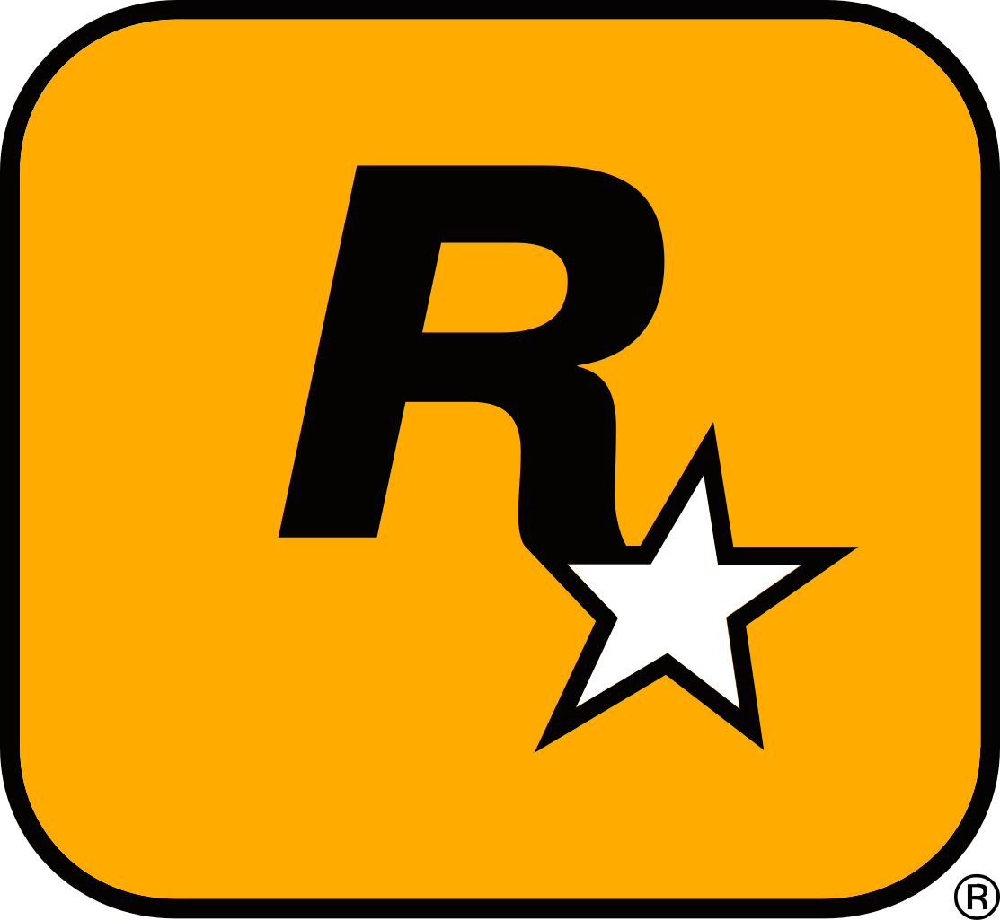

<!-- HEADINGS -->

# mi titulo
## mi titulo h2
### mi titulo h3
#### mi titulo h4
##### mi titulo h5
###### mi titulo h6

<!-- italic -->
this is an *italic* text en curva

<!-- strong -->
this is an **strong** text en negritas

<!-- strikethroungh -->
Este es un ~~texto~~ tachado

<!-- UL -->
* manzana
    * manzana 2
* pera
   * pera 3
* etc

1. manzana
   1. manzana 2
2. naranja 
    2. naranja 2
3. etc

[twitch.com](https://www.twitch.tv)

[twitch.com](https://www.twitch.tv "Aqui esta auron y rubius etc.")

> Mi perro se llama cobie

---
____

`console.log( hola mundo)`

``` C
#include <stdio.h>

int main() {
    float calif1, calif2, calif3, calif4, promedio;

    printf("Ingrese la calificación 1 Hulk: ");
    scanf("%f", &calif1);

    printf("Ingrese la calificación 2 Hulk: ");
    scanf("%f", &calif2);

    printf("Ingrese la calificación 3 Hulk: ");
    scanf("%f", &calif3);

    printf("Ingrese la calificación 4 Hulk: ");
    scanf("%f", &calif4);

    promedio = (calif1 + calif2 + calif3 + calif4) / 4;

    printf("El promedio es Hulk: %.2f\n", promedio);

    if (promedio >= 6.0) 
    {
        printf("APROBADO Yeah\n");
    } 

    if (promedio < 6.0) 
    {
        printf("REPROBADO Sad\n");
    }

    return 0;
}
```

|  Far Cry6  |  Castillo | Libertad |  
|------------|-----------|----------|
| GTA        | Los Santos|  Trevor  |

<!-- Link -->


<!-- Compu Carpeta -->



<!-- GITHUB MARKDOWN -->
* [x] Task 1
* [] Task 2
* [x] Task 3
* [] Task 4
* [x] Task 5